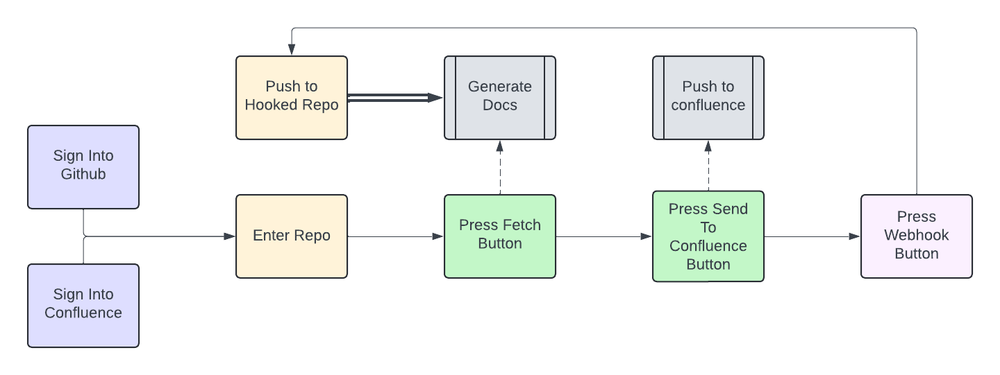

# Table of Contents

- [Table of Contents](#table-of-contents)
- [documentation-generation](#documentation-generation)
  - [Overview](#overview)
  - [Initial Implementation Goals](#initial-implementation-goals)
    - [Description](#description)
- [Run instructions](#run-instructions)
  - [Files to create](#files-to-create)
  - [Environment Variables to Make](#environment-variables-to-make)
  - [Backend](#backend)
  - [Frontend](#frontend)
- [Automated Tests](#automated-tests)
  - [Frontend Tests](#frontend-tests)
  - [Backend Tests](#backend-tests)

# documentation-generation

## Overview

Documentation is difficult to write and keep up to date. Tools exist to generate rudimentary JavaDoc for Java programs, but the result isn’t particularly helpful as it just gives parameter names and return types from the signature and no useful information. The goal of this project is to provide a more reasonable initial documentation source using LLMs and other tools.

For more detailed descriptions of our design, please visit [our documentation directory](https://github.com/dbhatia00/documentation-generation/tree/main/documentation).

This is how the user will interact with this application.


## Initial Implementation Goals

### Description

Our project is web app that, when provided a github link, generates a confluence page describing what the app does based on classes/methods within. The confluence pages shall follow the same file structure as the source code and shall have a one to one mapping. Each page shall describe the source code at the functional level, ensuring that the source code is covered to an acceptable level. The code works on **Java, Python, and Javascript** targets. 

# Run instructions

## Files to create

1. Download token_server.json and token_client.json from Slack
   1. Alternatively, generate a set of tokens from the Github Api and Confluence APIs
2. Put file token_server.json under path flask-be
   1. Should be in the following format - 
    ```javascript
    {
      "client_id": "{github API client ID}",
      "client_secret": "{github API client secret}",
      "confluence_client_id": "{confluence API client ID}",
      "confluence_client_secret": "{confluence API client secret}"
    }
    ```
3. Put file token_client.json under path react-fe/src
   1. Should be in the following format - 
    ```javascript
    {
      "client_id": "{github API client ID}",
      "confluence_client_id": "{confluence API client ID}"
    }
    ```

## Environment Variables to Make
1. Install [NGrok](https://ngrok.com/) to your machine
2. run `ngrok http 5000` and note the forwarding link (i.e. https://{...}.ngrok-free.app)
3. export the following variables
   1. `export WEBHOOK_SECRET={your NGrok secret}`
   2. `export WEBHOOK_PAYLOAD_URL={the above URL}/webhook1`

## Backend

1. python3 -m venv env
2. source env/bin/activate
3. pip install flask
4. pip install python-dotenv
5. pip install requests
6. pip install pymongo
7. pip install pydantic
8. cd flask-be
9. export PYTHONPATH="{path to repo}/documentation-generation/flask-be:$PYTHONPATH"
10. flask run

The backend should now be running

## Frontend

1. cd react-fe
2. npm install
3. npm start

The frontend should now be running

# Automated Tests

There are a suite of tests to ensure that the frontend is rendered as expected, and the core backend functions work as expected. Refer to the below instructions for more.

## Frontend Tests

The tests can be run by doing the following -

1. cd react-fe
2. npm test

This will run the tests in react-fe/src/\_\_tests\_\_/App.test.js

## Backend Tests

The tests can be run by doing the following -

1. cd flask-be
2. python test_base.py

This will run the tests in flask-be/test_base.py
