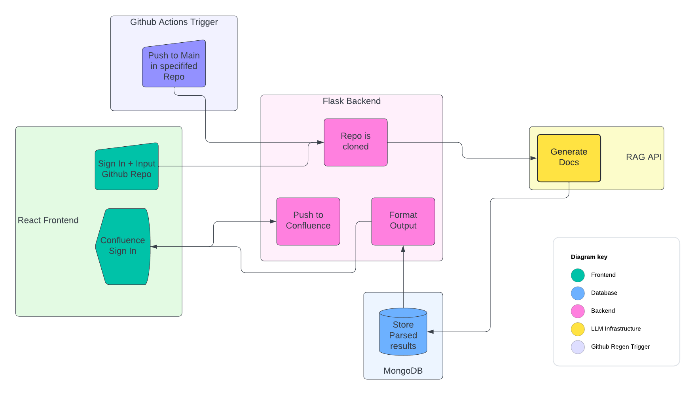
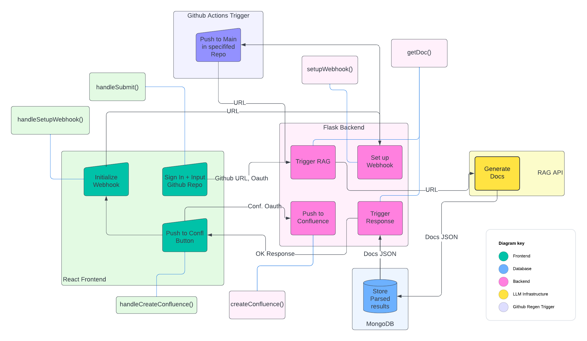

# Architecture

This is a basic overview of our architecture. For specific component definitions, please refer to the the [componentDescriptions folder](https://github.com/dbhatia00/documentation-generation/tree/main/documentation/componentDescriptions).

The approach features a fully distributed system, in which all of the user interaction is handled and packaged by a React frontend and processed by a Flask backend. An image of the architecture at a high level is in the first image below below.

For detailed overview of the key interfaces and the data being passed back and forth, refer to the second image below. 

